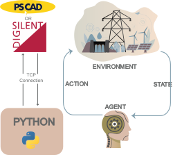
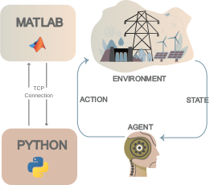
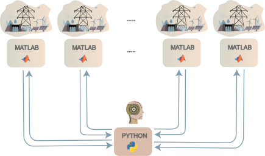

# TCP Co-Simulation Bridge: Extending Simulation Tools with External Controllers

Power system simulators like DIgSILENT PowerFactory and MATLAB/Simulink are excellent at what they do — but they lock you inside their own controller ecosystems. If you want to run a custom optimization, a machine learning model, or any logic that the tool does not natively support, you are forced to find a workaround.

This project provides a general-purpose bridge that solves that problem.

The idea is straightforward: expose the simulation inputs and outputs over TCP so that any external application — regardless of language or framework — can read measurements and send control signals back in real time, step by step, without breaking the simulation clock.

The two tools targeted here are PowerFactory and MATLAB/Simulink, but the bridge concept is the same for both.

---

## How It Works

<table>
  <tr>
    <td align="center" width="50%">
      <h3>PowerFactory</h3>
      
    </td>
    <td align="center" width="50%">
      <h3>MATLAB / Simulink</h3>
      
    </td>
  </tr>
</table>

At every simulation timestep, measurement signals are sent from the simulator to the external application over TCP. The external application processes them, computes a response, and sends control outputs back. The simulator blocks until it receives the reply, so the two sides remain fully synchronized.

The external application can be written in any language. In this repository, Python is used as the implementation example.

---

## Scaling Up: Running Multiple Simulations in Parallel

When the external logic involves training a model — such as a reinforcement learning agent — a single simulation is a bottleneck. The bridge supports running multiple simulator instances simultaneously, each connected through a separate communication channel.

Each simulation instance runs on its own CPU core, collecting experience independently. The results are fed into a shared training process, making data collection as fast as the number of available cores allows.

---

## What This Repository Contains

- A TCP bridge implementation for **DIgSILENT PowerFactory** using a compiled DLL external function.
- A TCP bridge implementation for **MATLAB/Simulink** using TCP send/receive blocks.
- A working example of the MATLAB bridge applied to reinforcement learning: a DDPG agent trained to control a Buck DC-DC converter, with multiple Simulink instances running concurrently.

The two frameworks are independent and can be used separately.

---

## Full Documentation

- [Matlab-Python/README.md](Matlab-Python/README.md) — setup, architecture, and usage for the MATLAB/Simulink bridge and RL example.
- [PowerFactory-Python/Readme.md](PowerFactory-Python/Readme.md) — setup, DLL configuration, and usage for the PowerFactory bridge.

---

## Citation

Peykarporsan, R. — DOI: 10.1109/KPEC58008.2023.10215460  
Full metadata: [Citation.cff](Citation.cff)

## Author

Rasool Peykarporsan  
ORCID: <https://orcid.org/0009-0006-5237-3847>
